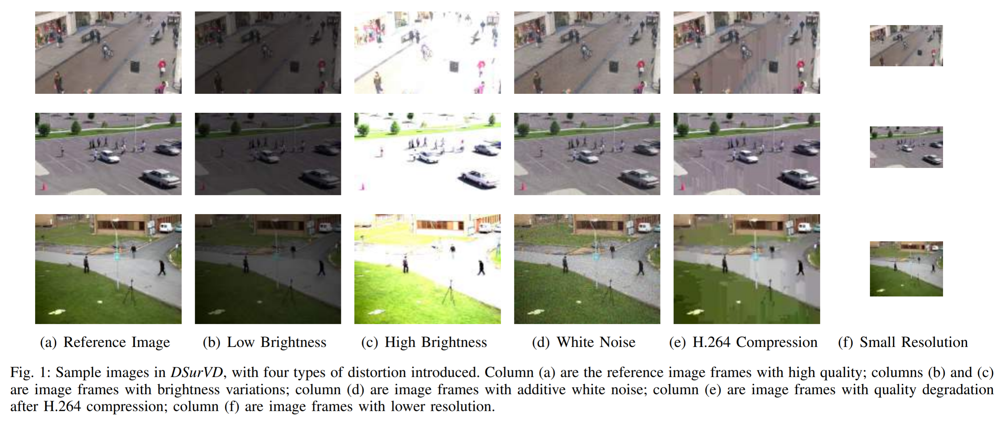
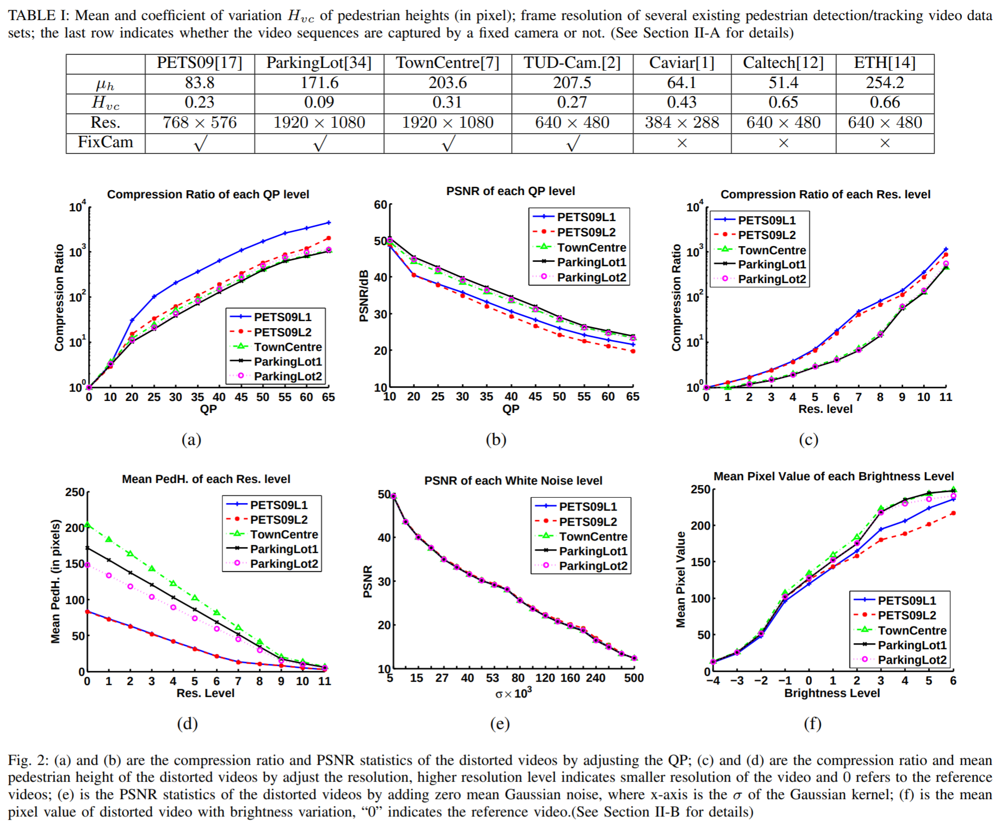
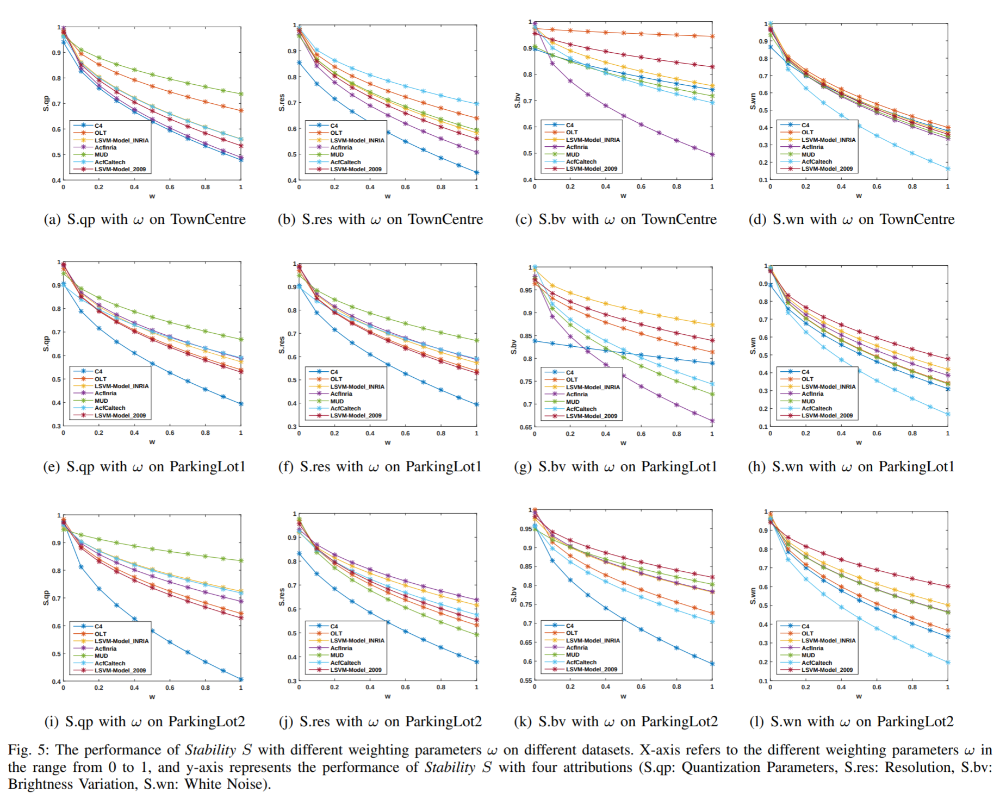
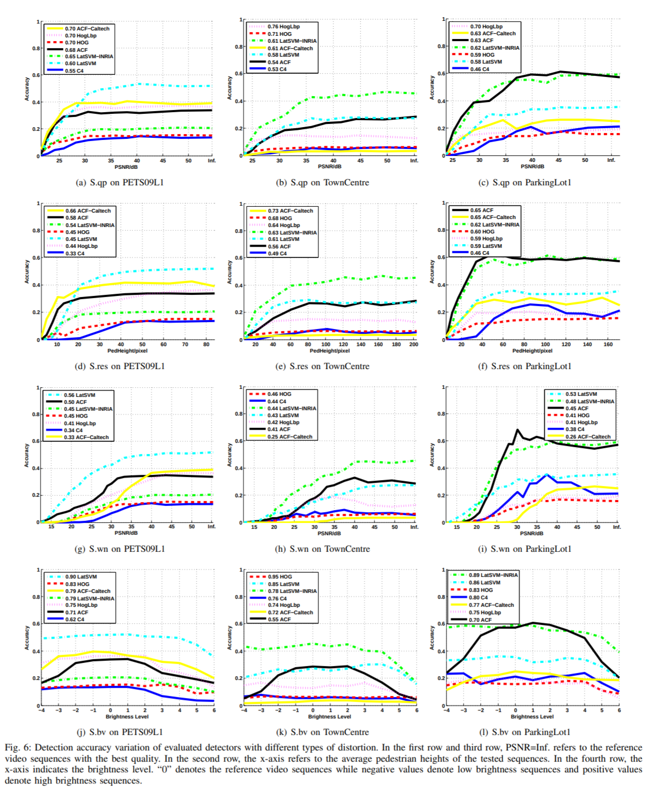
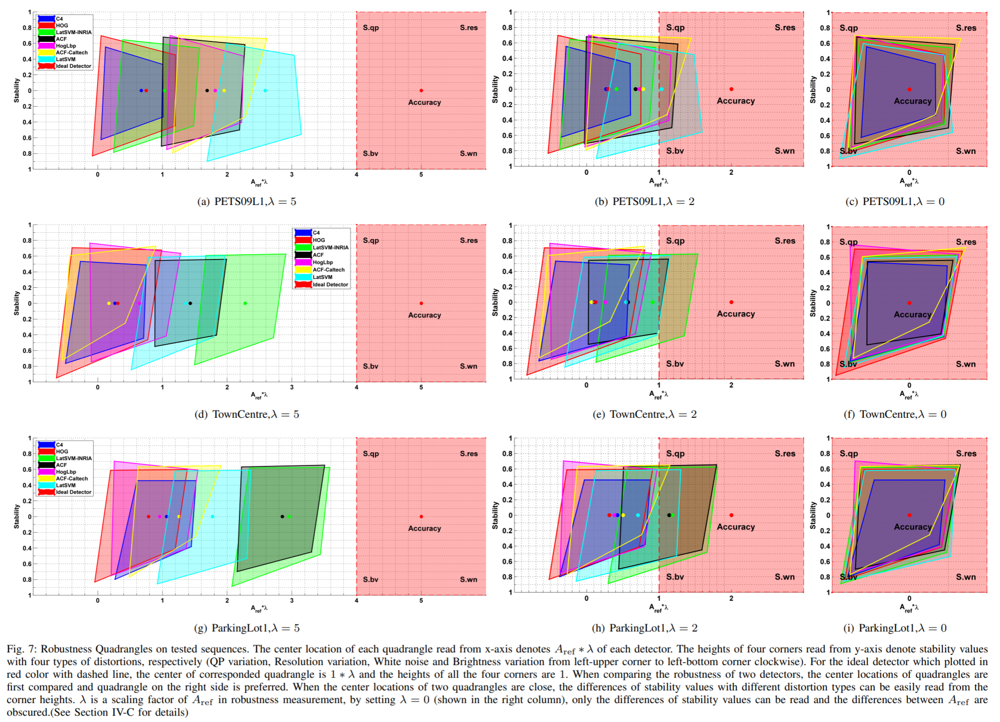

# PedestrianIQA
## Robustness Analysis of Pedestrian Detectors for Surveillance ( [pdf](https://arxiv.org/abs/1807.04562) )

In this work, we propose a large-scale dataset, namely Distorted Surveillance Video Database (DSurVD), which can be downloaded from the link: https://sites.google.com/site/sorsyuanyuan/home/dsurvd

If you would like to use our dataset in your research, please cite the folloing paper:

```sh
@article{fang2018robustness,
  title={Robustness analysis of pedestrian detectors for surveillance},
  author={Fang, Yuming and Ding, Guanqun and Yuan, Yuan and Lin, Weisi and Liu, Haiwen},
  journal={IEEE Access},
  volume={6},
  pages={28890--28902},
  year={2018},
  publisher={IEEE}
}
```










